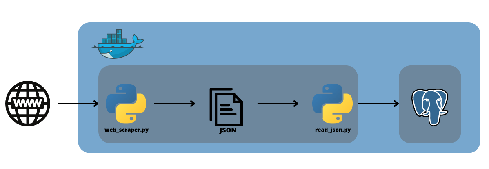

# Realestate WebScraper
Simple web scraper for real estate data from OtoDom.pl. Build using Python, Docker and PostgreSQL.
## Table of contents:
- [Realestate WebScraper](#realestate-webscraper)
  - [Table of contents:](#table-of-contents)
  - [Description](#description)
  - [Tools used](#tools-used)
  - [How to run](#how-to-run)
  - [To-do](#to-do)

## Description
The project is a web scraper designed to gather data about real estate listings in the Wołomin County area. It extracts information from the OtoDom website and stores it in JSON format before exporting it to a PostgreSQL database. The scraper is scheduled to run periodically using cron. The project utilizes two Docker containers: one for the Python environment and another for the PostgreSQL database.

## Tools used
* Python 3.10
  * BeautifulSoup
  * Pandas
  * SQLAlchemy
  * Requests
* Docker
* Cron
* PostgreSQL



## How to run
1. Clone the repository
2. Build and start the Docker containers using docker-compose:

*Note: It is highly recommended to start this project using Docker containers. Running the project outside Docker containers may result in errors during pipeline execution due to configuration issues. Docker provides a standardized and isolated environment for running the project, ensuring consistent and reproducible results.*

```bash
docker-compose up -d
```
1. The scraper will run automatically daily at 6 am UTC.
   * Sample data in JSON format is provided in the `web-scraper/data` folder.

2. To stop the containers, use the following command:

```bash
docker-compose down
```

## To-do
- [ ] Add visualization of data
- [ ] Add bash script for simple manual execution
- [ ] Import more data from JSON files to database
- [ ] Expand Readme